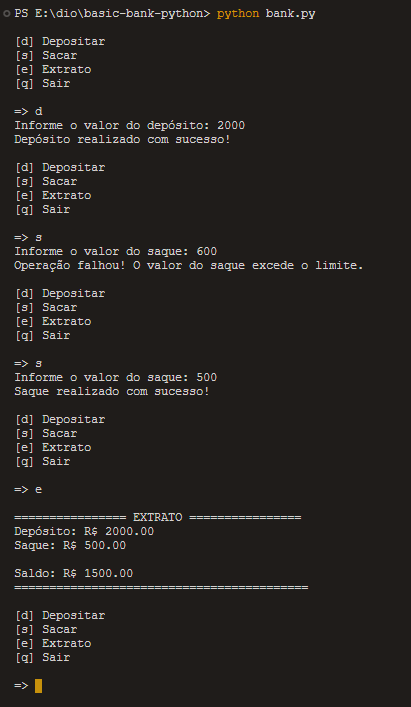

# Sistema Bancário Simples

Este projeto é uma simulação simples de um sistema bancário implementado em Python. Ele permite ao usuário realizar operações básicas como depósito, saque e visualização de extrato.

## Funcionalidades

- **Depósito**: Adiciona fundos à conta do usuário.
- **Saque**: Retira fundos da conta do usuário, respeitando o saldo e o limite de saques.
- **Extrato**: Exibe todas as movimentações realizadas na conta, bem como o saldo atual.
- **Sair**: Encerra a sessão do usuário no sistema.

## Como Executar

Para executar o sistema bancário, você precisará ter o Python instalado em sua máquina. Com o Python instalado, siga os passos abaixo:

1. Clone o repositório ou baixe o arquivo `bank.py`.
2. Abra o terminal ou prompt de comando.
3. Navegue até o diretório onde o arquivo `bank.py` está localizado.
4. Execute o comando `python bank.py`.

## Estrutura do Código

O código está organizado em funções que representam cada uma das operações disponíveis no menu do sistema bancário. A função `main` é o ponto de entrada do programa, onde o loop principal é executado e as opções do usuário são processadas.

**Nota**: Este é um projeto de exemplo e não deve ser utilizado para transações financeiras reais.
